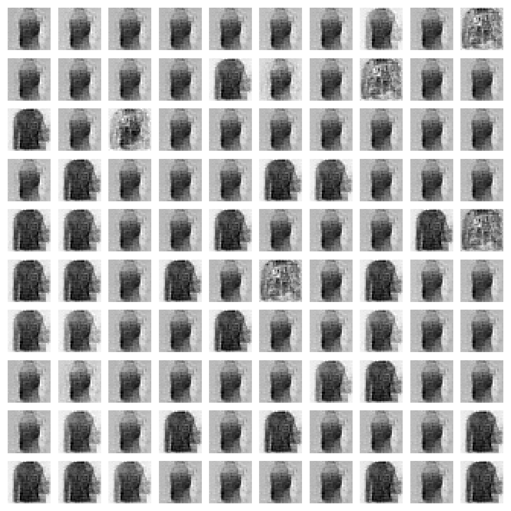

## Implementing GAN on Fashion_MNIST Dataset

In this project I implement a GAN which is trained on the fashion-mnist dataset.

All the notes and progress are in the notebook. Refer to the notebook.

### Result 
After training the model for 10,000 epochs the resulting were pretty convinving.

